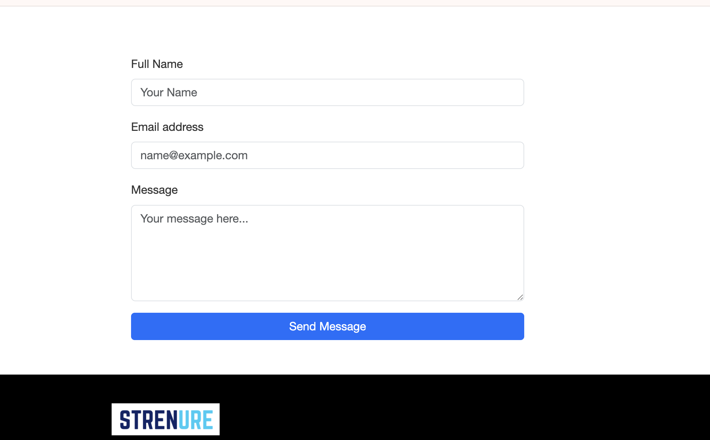
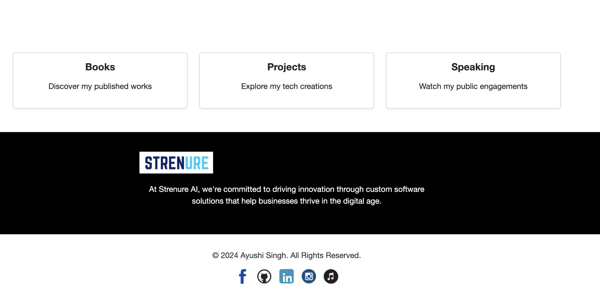

# My Personal Website | Hosted on GITHUB SERVER

My site is live at https://techwithher.github.io/ayushisingh.github.io/

### FYI: My real website is www.ayushisingh.com

## Overview
This project contains the source code for my sample personal portfolio website. The website is built using simple front-end technologies and is hosted using GitHub Pages.

The purpose of this project is to showcase:

* How we can host the simple HTML code on GitHub Pages
* Rough Structuring of HTML and CSS

This repository focuses only on the **website code and content**.
A separate repository will be used to demonstrate **DevOps automation and cloud deployment for the same website**.
Link of the Repo: 

---

# Tech Stack

Frontend

* HTML5
* CSS3
* JavaScript


Hosting

* GitHub Pages

Version Control

* Git
* GitHub

---

# Project Structure

```
Ayushi_Personal_Website
│
├── index.html
├── books.html
├── contact.html
├── media.html
├── projects.html
├── speaking.html
│
├── css/
│   └── styles.css
│
├── js/
│   └── scripts.js
│
├── images/
│
├── components/
│
└── README.md
```

---

# Website Pages

### Home

Introduction and overview of the website.

### Projects

Highlights technical projects and initiatives.

### Books

Shares recommended reading resources.

### Speaking

Information about talks, events, and speaking engagements.

### Media

Media appearances and interviews.

### Contact

Ways to reach out and connect.

---

### Some Helpful Screenshots for Overview: 





